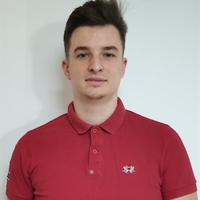

# Welcome

Welcome to the *Microprocessor Programming (PM)* class.

During the class you will learn how to design and implement a hardware device. 

You takeaways from the course are:
  - learning how a microprocessor (*MCU*) works, using as an example the RP2040 MCU from the [Raspberry Pi Pico W](https://www.raspberrypi.com/products/raspberry-pi-pico/) as well as a Atmega328P;
  - learning how to design your hardware schematics using [KiCad](https://www.kicad.org/) and how to create the bill of materials (*BOM*) for it;
  - building the hardware device either using a breadboard, a prototyping board or a printed circuit board (*PCB*);
  - learning how to develop the software that controls hardware in [Rust](https://www.rust-lang.org/);
  - learning how to develop the software that controls hardware in C;
  - presenting the hardware device at the *PM Fair* show.

## Team

<table>
<tr valign="top">
<td>
**Daniel Rosner**

Course Professor \
daniel.rosner[at]upb.ro
</td>

<td>
**Irina Niță**

 
Lab Professor \
Responsible for software \
GitHub: [irina-nita](https://github.com/irina-nita) \
irina.nita@oxidos.io
</td>

<td>
**Irina Bradu**

 
Lab Professor \
GitHub: [Irina Bradu](https://github.com/irina-b-dev) \
irina.bradu@wyliodrin.com
</td>
</tr>

<tr valign="top">
<td>
**Gabriel Păvăloiu**

 
Lab Professor \
GitHub: [GabrielPavaloiu](https://github.com/GabrielPavaloiu) \
gabriel.pavaloiu@upb.ro
</td>

<td>
**Andrei Zamfir**

 
Lab Professor \
Responsible for hardware \
GitHub: [ZamfirAndreiPaul](https://github.com/ZamfirAndreiPaul) \
andrei.zamfir@wyliodrin.com
</td>

<td>
**Teodor Dicu**

 
Lab Professor\
Responsible for hardware\
GitHub: [DTeodor-Alexaandru](https://github.com/DTeodor-Alexaandru) \
teodor.dicu@wyliodrin.com
</td>
</tr>

<tr valign="top">
<td>
**Alexandru Ungureanu**

Lab Professor \
GitHub: [AlexU01](https://github.com/AlexU01) \
alexagungureanu@gmail.com
</td>

</tr>

</table>

## Timetable

| Activity | Group | Day | Hour | Room | Professor |
|----------|-------|-----|------|-------|----------|
| Lecture | *all students* | Wednesday | 08 - 10 | EC105 | Daniel Rosner|
| Lecture | *all students* | Monday | 18 - 20 | PR001 | Daniel Rosner|
| Lab | 331CC A | Tuesday | 12 - 14 | ED218 | Teodor Dicu |
| Lab | 331CC B | Tuesday | 12 - 14 | ED217 | Irina Bradu |
| Lab | 332CC A | Tuesday | 14 - 16 | ED218 | Irina Niță |
| Lab | 332CC B | Tuesday | 14 - 16 | ED217 | Irina Bradu |
| Lab | 333CC A | Wednesday | 16 - 18 | ED218 | Teodor Dicu |
| Lab | 333CC B | Wednesday | 16 - 18 | ED217 | Alexandru Ungureanu |
| Lab | 334CC A | Wednesday | 18 - 20 | ED218 | Andrei Zamfir |
| Lab | 334CC B | Wednesday | 18 - 20 | ED217 | Alexandru Ungureanu |
| Lab | 335CC A | Thursday | 18 - 20 | ED218 | Andrei Zamfir |
| Lab | 335CC B | Thursday | 18 - 20 | ED217 | Gabriel Păvăloiu |

## Grading

| Part | Description | Points |
|--------|-------------|--------|
| [Lecture](./category/lecture) tests | You will have a test every few classes with subjects from the previous class (will pe anounced). | 2p |
| [Lab](./category/lab) | Your work at every lab will be graded. | 2p |
| [Project](./project) | You will have to design and implement a hardware device. Grading will be done for the documentation, hardware design and software development. | 4p |
| Exam | You will have to take an exam during the session. This will be in written format. | 4p |
| **Total** | *You will need at least 5 points to pass the subject.* | **11p** |

## Rules

1. You can be absent without motivation at a maximum of 2 labs.
2. Labs **CANNOT BE RECOVERED OUTSIDE THE CURRENT WEEK**
3. You can justify your absence from the lab (medical reasons) within a maximum of 2 weeks from the date of your absence
4. Each student must come with their group to the lab, if there are problems you must announce in advance.
5. You can be late for lab up to 10 minutes
6. Students who are catching up on the subject can participate at labs only if there are free places
7. You will need a [github](https://www.github.com) account with your full name and a real profile photo
 
## Bibliography

### Hardware
1. **Joseph Yiu**, *The Definitive Guide to ARM® Cortex®-M0 and Cortex-M0+ Processors, 2nd Edition* 
2. **Joseph Yiu**, *The Definitive Guide to ARM® Cortex®-M23 and Cortex-M33 Processors* 
2. **Charles Platt**, *Encyclopedia of Electronic Components*, Volumes 1, 2, 3 
3. **Paul Scherz, Simon Monk**, *Practical Electronics for Inventors, 2nd edition*
4. **Raspberry Pi Ltd**, *[RP2040 Datasheet](https://datasheets.raspberrypi.com/rp2040/rp2040-datasheet.pdf)*

### Software
1. **Steve Klabnik, Carol Nichols**, *[The Rust Programming Language](https://doc.rust-lang.org/stable/book/)*
2. **Rust Team**, *[Rust Embedded, The Discovery book](https://docs.rust-embedded.org/discovery/microbit/)*
3. **Raspberry Pi Ltd**, *[Getting started with Raspberry Pi Pico-series](https://datasheets.raspberrypi.com/pico/getting-started-with-pico.pdf)*
4. [embassy_rp](https://docs.embassy.dev/embassy-rp/git/rp2040/index.html) crate documentation
5. [embassy_rp examples](https://github.com/embassy-rs/embassy/tree/main/examples/rp/src/bin)
6. [Raspberry Pi Pico Python SDK](https://datasheets.raspberrypi.com/pico/raspberry-pi-pico-python-sdk.pdf)
7. [Connecting to the Internet with Raspberry Pi Pico W](https://datasheets.raspberrypi.com/picow/connecting-to-the-internet-with-pico-w.pdf)
